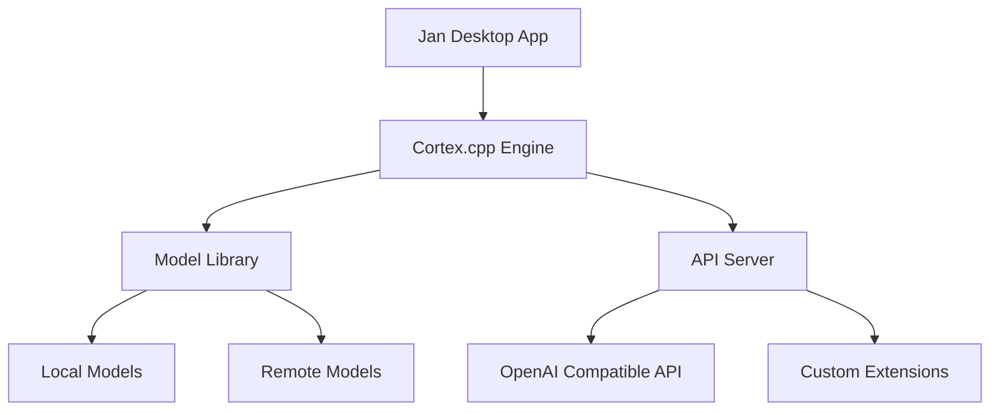
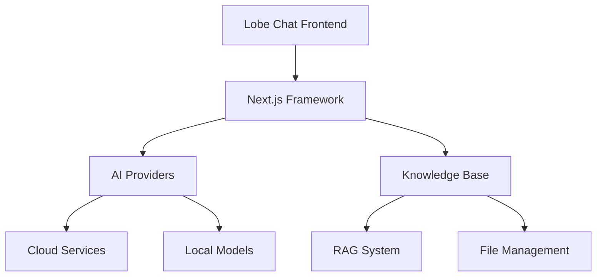

# Competitive Analysis: Jan & Lobe Chat

## 1. Feature Comparison

### Jan (Local AI Assistant)
**Key Features:**
1. **Local Processing**
   - 100% offline operation
   - Universal architecture support (NVIDIA, Apple M-series, Intel)
   - Model library with popular LLMs (Llama, Gemma, Mistral, Qwen)

2. **Architecture**
   - Powered by Cortex.cpp (C++ CLI)
   - Multi-engine support (llama.cpp, ONNX, TensorRT-LLM)
   - Universal binary support

3. **Integration**
   - Remote AI API support (Groq, OpenRouter)
   - Local API Server with OpenAI-equivalent API
   - Extensions system for customization

### Lobe Chat
**Key Features:**
1. **Multi-Modal Support**
   - Multiple AI providers (OpenAI, Claude 3, Gemini, Ollama, DeepSeek, Qwen)
   - Knowledge Base with RAG
   - Multi-modal plugins/artifacts

2. **Architecture**
   - Next.js-based framework
   - TypeScript implementation
   - Modern design system

3. **Advanced Features**
   - File upload and knowledge management
   - Plugin system
   - Thinking mode

## 2. Implementation Insights

### Jan's Technical Approach


**Key Implementation Details:**
1. **Local Processing**
   - Uses Cortex.cpp for model execution
   - Supports multiple hardware architectures
   - Efficient memory management

2. **API Design**
   - OpenAI-compatible API
   - Local server implementation
   - Extension system

### Lobe Chat's Technical Approach


**Key Implementation Details:**
1. **Modern Stack**
   - Next.js for frontend
   - TypeScript for type safety
   - Modern UI components

2. **Plugin Architecture**
   - Modular plugin system
   - Extensible design
   - Custom integrations

## 3. Feature Gap Analysis

### What We Can Learn from Jan
1. **Local Processing**
   ```swift
   // Example: Local Model Integration
   protocol LocalModelEngine {
       func loadModel(_ model: AIModel) async throws
       func process(_ input: String) async throws -> String
       func unloadModel() async
   }
   ```

2. **Hardware Optimization**
   ```swift
   // Example: Hardware Detection
   enum HardwareType {
       case appleSilicon
       case intel
       case nvidia
       
       var optimizedEngine: ModelEngine {
           switch self {
           case .appleSilicon: return MLXEngine()
           case .intel: return CPUEngine()
           case .nvidia: return CUDAEngine()
           }
       }
   }
   ```

### What We Can Learn from Lobe Chat
1. **Plugin System**
   ```swift
   // Example: Plugin Architecture
   protocol ChatPlugin {
       var name: String { get }
       var description: String { get }
       func execute(_ context: ChatContext) async throws -> PluginResult
   }
   ```

2. **Knowledge Base**
   ```swift
   // Example: RAG Implementation
   class KnowledgeBase {
       func indexDocument(_ document: Document) async throws
       func search(_ query: String) async throws -> [RelevantContent]
       func updateIndex() async throws
   }
   ```

## 4. Recommendations for MinimalAIChat

### Immediate Improvements
1. **Local Processing**
   - Implement local model support
   - Add hardware optimization
   - Improve memory management

2. **Plugin System**
   - Design extensible plugin architecture
   - Create plugin marketplace
   - Implement plugin sandboxing

3. **Knowledge Base**
   - Add RAG system
   - Implement document indexing
   - Create search functionality

### Architecture Enhancements
1. **Modular Design**
   ```swift
   // Example: Enhanced Service Architecture
   protocol AIServiceProtocol {
       var capabilities: [AICapability] { get }
       func initialize() async throws
       func process(_ input: String) async throws -> String
       func cleanup() async
   }
   ```

2. **Extension System**
   ```swift
   // Example: Extension Framework
   protocol ChatExtension {
       var id: String { get }
       var name: String { get }
       var version: String { get }
       func activate() async throws
       func deactivate() async
   }
   ```

## 5. Market Differentiation

### Our Unique Value Proposition
1. **Native macOS Experience**
   - Better performance than web-based solutions
   - Native UI/UX
   - System integration

2. **Privacy Focus**
   - Local processing options
   - Secure data handling
   - User control

3. **Developer Experience**
   - Swift-native implementation
   - Clear documentation
   - Easy extension development

## 6. Implementation Priorities

### Phase 1: Core Stability
1. **Memory Management**
   - Implement proper cleanup
   - Add memory pressure handling
   - Optimize resource usage

2. **Session Handling**
   - Improve validation
   - Add encryption
   - Implement timeouts

### Phase 2: Feature Enhancement
1. **Local Processing**
   - Add local model support
   - Implement hardware detection
   - Optimize performance

2. **Plugin System**
   - Design plugin architecture
   - Create plugin API
   - Implement sandboxing

### Phase 3: Advanced Features
1. **Knowledge Base**
   - Implement RAG system
   - Add document indexing
   - Create search functionality

2. **Integration**
   - Add more AI providers
   - Implement cross-platform sync
   - Create extension marketplace

## 7. Technical Considerations

### Performance Optimization
1. **Memory Management**
   ```swift
   // Example: Resource Management
   class ResourceManager {
       private var resources: [Resource] = []
       private let memoryThreshold: Int
       
       func monitorMemory() async {
           while true {
               if currentMemoryUsage > memoryThreshold {
                   await cleanupUnusedResources()
               }
               try? await Task.sleep(nanoseconds: 1_000_000_000)
           }
       }
   }
   ```

2. **Caching System**
   ```swift
   // Example: Response Caching
   class ResponseCache {
       private var cache: [String: CachedResponse] = [:]
       private let maxSize: Int
       
       func cache(_ response: String, for query: String) {
           if cache.count >= maxSize {
               removeOldestEntry()
           }
           cache[query] = CachedResponse(response: response, timestamp: Date())
       }
   }
   ```

### Security Implementation
1. **Data Protection**
   ```swift
   // Example: Secure Storage
   class SecureStorage {
       func encryptAndStore(_ data: Data) throws {
           let encrypted = try encrypt(data)
           try store(encrypted)
       }
       
       func retrieveAndDecrypt() throws -> Data {
           let encrypted = try retrieve()
           return try decrypt(encrypted)
       }
   }
   ```

2. **API Security**
   ```swift
   // Example: API Authentication
   class APISecurity {
       func validateRequest(_ request: APIRequest) throws {
           guard request.isValid else { throw APIError.invalidRequest }
           guard request.isAuthenticated else { throw APIError.unauthorized }
           guard request.isAuthorized else { throw APIError.forbidden }
       }
   }
   ```

## 8. Next Steps

### Immediate Actions
1. Review and implement local processing capabilities
2. Design and implement plugin system
3. Enhance security measures

### Medium-term Goals
1. Implement knowledge base with RAG
2. Add more AI providers
3. Create extension marketplace

### Long-term Vision
1. Cross-platform support
2. Advanced features
3. Market expansion 