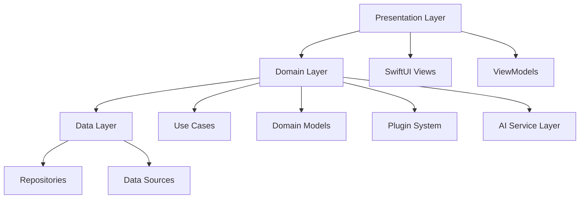

# MinimalAIChat V2: Architecture & Development Plan

## 1. Project Overview & Vision

### Core Vision
- Create a privacy-focused, high-performance macOS AI chat application
- Support both local and cloud-based AI models
- Provide seamless integration with macOS ecosystem
- Enable extensibility through plugins and custom integrations

### Key Differentiators
1. **Privacy First**
   - Local model support
   - End-to-end encryption
   - Zero data collection in local mode

2. **Performance**
   - Native macOS implementation
   - Hardware-optimized processing
   - Efficient memory management

3. **Extensibility**
   - Plugin architecture
   - Custom integrations
   - Developer-friendly API

## 2. Architecture Design

### Core Architecture


### Module Organization
```
MinimalAIChat/
├── App/
│   ├── Core/
│   │   ├── Domain/
│   │   │   ├── Models/
│   │   │   ├── UseCases/
│   │   │   └── Interfaces/
│   │   ├── Data/
│   │   │   ├── Repositories/
│   │   │   ├── DataSources/
│   │   │   └── Persistence/
│   │   └── Infrastructure/
│   │       ├── Network/
│   │       ├── Security/
│   │       └── System/
│   ├── Features/
│   │   ├── Chat/
│   │   ├── Settings/
│   │   └── Plugins/
│   └── Shared/
│       ├── Extensions/
│       ├── Utilities/
│       └── Resources/
├── Tests/
│   ├── Unit/
│   ├── Integration/
│   └── UI/
└── Package.swift
```

## 3. Package Management Strategy

### Swift Package Manager Configuration
```swift
// Package.swift
let package = Package(
    name: "MinimalAIChat",
    platforms: [
        .macOS(.v13)
    ],
    products: [
        .library(name: "MinimalAIChat", targets: ["MinimalAIChat"]),
        .library(name: "MinimalAIChatCore", targets: ["MinimalAIChatCore"]),
        .library(name: "MinimalAIChatUI", targets: ["MinimalAIChatUI"])
    ],
    dependencies: [
        .package(url: "https://github.com/apple/swift-log.git", from: "0.5.0"),
        .package(url: "https://github.com/apple/swift-async-algorithms.git", from: "0.1.0"),
        .package(url: "https://github.com/apple/swift-collections.git", from: "0.1.0"),
        .package(url: "https://github.com/apple/swift-crypto.git", from: "2.0.0"),
        .package(url: "https://github.com/apple/swift-numerics.git", from: "1.0.0")
    ],
    targets: [
        .target(
            name: "MinimalAIChatCore",
            dependencies: [
                .product(name: "Logging", package: "swift-log"),
                .product(name: "AsyncAlgorithms", package: "swift-async-algorithms"),
                .product(name: "Collections", package: "swift-collections"),
                .product(name: "Crypto", package: "swift-crypto"),
                .product(name: "Numerics", package: "swift-numerics")
            ]
        ),
        .target(
            name: "MinimalAIChatUI",
            dependencies: ["MinimalAIChatCore"]
        ),
        .target(
            name: "MinimalAIChat",
            dependencies: ["MinimalAIChatCore", "MinimalAIChatUI"]
        ),
        .testTarget(
            name: "MinimalAIChatTests",
            dependencies: ["MinimalAIChat"]
        )
    ]
)
```

### Dependency Management Best Practices
1. **Version Control**
   - Use exact versions for critical dependencies
   - Regular dependency updates
   - Automated dependency scanning

2. **Module Separation**
   - Core functionality in separate modules
   - Clear dependency boundaries
   - Interface-based design

3. **Testing Dependencies**
   - Separate test dependencies
   - Mocking frameworks
   - Test utilities

## 4. Core Features Implementation

### 1. AI Service Layer
```swift
// Core AI Service Protocol
protocol AIServiceProtocol {
    var capabilities: [AICapability] { get }
    var modelType: AIModelType { get }
    
    func initialize() async throws
    func process(_ input: String) async throws -> String
    func cleanup() async
}

// Local Model Support
protocol LocalModelProtocol: AIServiceProtocol {
    var modelPath: URL { get }
    var hardwareType: HardwareType { get }
    
    func loadModel() async throws
    func unloadModel() async
}

// Cloud Model Support
protocol CloudModelProtocol: AIServiceProtocol {
    var apiKey: String { get }
    var endpoint: URL { get }
    
    func validateCredentials() async throws
    func refreshToken() async throws
}
```

### 2. Plugin System
```swift
// Plugin Protocol
protocol ChatPlugin {
    var id: String { get }
    var name: String { get }
    var version: String { get }
    var capabilities: [PluginCapability] { get }
    
    func activate() async throws
    func deactivate() async
    func execute(_ context: PluginContext) async throws -> PluginResult
}

// Plugin Manager
actor PluginManager {
    private var plugins: [String: ChatPlugin] = [:]
    private let sandbox: PluginSandbox
    
    func loadPlugin(_ plugin: ChatPlugin) async throws
    func unloadPlugin(_ id: String) async
    func executePlugin(_ id: String, context: PluginContext) async throws -> PluginResult
}
```

### 3. Knowledge Base & RAG
```swift
// Document Management
protocol DocumentManager {
    func indexDocument(_ document: Document) async throws
    func search(_ query: String) async throws -> [RelevantContent]
    func updateIndex() async throws
}

// Vector Store
protocol VectorStore {
    func store(_ embedding: Vector) async throws
    func search(_ query: Vector) async throws -> [Vector]
    func delete(_ id: String) async throws
}
```

## 5. Development Process

### 1. Code Organization
- Feature-based organization
- Clear dependency boundaries
- Interface-based design
- Protocol-oriented programming

### 2. Testing Strategy
```swift
// Unit Testing
class AIServiceTests: XCTestCase {
    var sut: AIServiceProtocol!
    var mockStorage: MockStorage!
    
    override func setUp() {
        super.setUp()
        mockStorage = MockStorage()
        sut = AIService(storage: mockStorage)
    }
    
    func testProcessMessage() async throws {
        // Given
        let message = "Hello"
        
        // When
        let response = try await sut.process(message)
        
        // Then
        XCTAssertNotNil(response)
    }
}

// Integration Testing
class IntegrationTests: XCTestCase {
    var app: MinimalAIChat!
    
    override func setUp() {
        super.setUp()
        app = MinimalAIChat()
    }
    
    func testEndToEndFlow() async throws {
        // Test complete user flow
    }
}
```

### 3. CI/CD Pipeline
```yaml
# GitHub Actions Workflow
name: CI

on:
  push:
    branches: [ main ]
  pull_request:
    branches: [ main ]

jobs:
  build:
    runs-on: macos-latest
    steps:
      - uses: actions/checkout@v2
      - name: Build
        run: swift build
      - name: Test
        run: swift test
      - name: Lint
        run: swiftlint
```

## 6. Performance Optimization

### 1. Memory Management
```swift
// Resource Manager
actor ResourceManager {
    private var resources: [Resource] = []
    private let memoryThreshold: Int
    
    func monitorMemory() async {
        while true {
            if currentMemoryUsage > memoryThreshold {
                await cleanupUnusedResources()
            }
            try? await Task.sleep(nanoseconds: 1_000_000_000)
        }
    }
    
    private func cleanupUnusedResources() async {
        // Implement cleanup logic
    }
}
```

### 2. Caching Strategy
```swift
// Response Cache
actor ResponseCache {
    private var cache: [String: CachedResponse] = [:]
    private let maxSize: Int
    
    func cache(_ response: String, for query: String) {
        if cache.count >= maxSize {
            removeOldestEntry()
        }
        cache[query] = CachedResponse(response: response, timestamp: Date())
    }
}
```

## 7. Security Implementation

### 1. Data Protection
```swift
// Secure Storage
class SecureStorage {
    private let keychain: KeychainManager
    
    func encryptAndStore(_ data: Data) throws {
        let encrypted = try encrypt(data)
        try store(encrypted)
    }
    
    func retrieveAndDecrypt() throws -> Data {
        let encrypted = try retrieve()
        return try decrypt(encrypted)
    }
}
```

### 2. API Security
```swift
// API Security
class APISecurity {
    func validateRequest(_ request: APIRequest) throws {
        guard request.isValid else { throw APIError.invalidRequest }
        guard request.isAuthenticated else { throw APIError.unauthorized }
        guard request.isAuthorized else { throw APIError.forbidden }
    }
}
```

## 8. Development Timeline

### Phase 1: Core Infrastructure (4 weeks)
1. Project setup and architecture
2. Core services implementation
3. Basic UI framework

### Phase 2: Feature Implementation (6 weeks)
1. AI service integration
2. Plugin system
3. Knowledge base

### Phase 3: Polish & Optimization (4 weeks)
1. Performance optimization
2. Security hardening
3. UI/UX refinement

### Phase 4: Testing & Launch (2 weeks)
1. Comprehensive testing
2. Documentation
3. App Store submission

## 9. Success Metrics

### Performance Metrics
- Memory usage < 100MB
- Startup time < 2s
- Response latency < 500ms

### Quality Metrics
- Test coverage > 80%
- Zero critical bugs
- < 1% crash rate

### User Metrics
- User retention > 80%
- Feature adoption > 60%
- User satisfaction > 4.5/5

## 10. Risk Mitigation

### Technical Risks
1. **Memory Leaks**
   - Regular memory audits
   - Automated testing
   - Performance monitoring

2. **Security Vulnerabilities**
   - Regular security audits
   - Penetration testing
   - Code review

3. **Performance Issues**
   - Performance testing
   - Load testing
   - Optimization

### Business Risks
1. **Market Competition**
   - Feature differentiation
   - Performance advantage
   - User experience

2. **User Adoption**
   - User feedback
   - Feature prioritization
   - Marketing strategy 