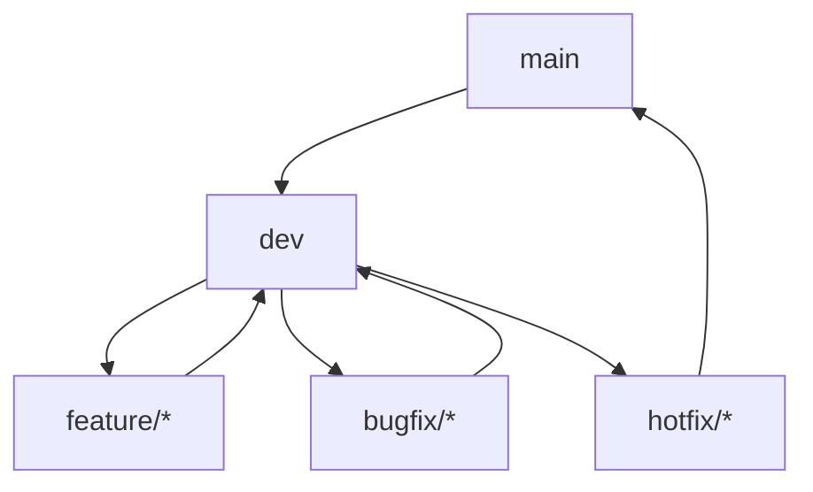

# MinimalAIChat V2: Implementation Plan

## 1. Development Workflow

### Branch Strategy


### Branch Rules
1. **main**
   - Production-ready code
   - Tagged releases
   - Protected branch
   - Requires PR review

2. **dev**
   - Integration branch
   - Feature merge target
   - Daily builds
   - Automated testing

3. **feature/***
   - New feature development
   - Branch naming: `feature/component-name`
   - Created from: dev
   - Merged to: dev

4. **bugfix/***
   - Bug fixes
   - Branch naming: `bugfix/issue-description`
   - Created from: dev
   - Merged to: dev

5. **hotfix/***
   - Production fixes
   - Branch naming: `hotfix/issue-description`
   - Created from: main
   - Merged to: main and dev

### Commit Strategy
```
feat: Add new feature
fix: Fix bug
docs: Update documentation
style: Code style changes
refactor: Code refactoring
test: Add/update tests
chore: Maintenance tasks
```

## 2. Component Breakdown

### 1. Core Infrastructure

#### 1.1 Domain Layer
```swift
// Core Domain Models
struct ChatMessage: Identifiable, Codable {
    let id: UUID
    let content: String
    let role: MessageRole
    let timestamp: Date
    let metadata: MessageMetadata
}

enum MessageRole: String, Codable {
    case user
    case assistant
    case system
}

struct MessageMetadata: Codable {
    let model: AIModelType
    let tokens: Int
    let processingTime: TimeInterval
}

// Use Cases
protocol ChatUseCase {
    func sendMessage(_ message: String) async throws -> ChatMessage
    func loadHistory() async throws -> [ChatMessage]
    func clearHistory() async throws
}
```

#### 1.2 Data Layer
```swift
// Repositories
protocol ChatRepository {
    func save(_ message: ChatMessage) async throws
    func load() async throws -> [ChatMessage]
    func delete(_ id: UUID) async throws
}

// Data Sources
protocol LocalDataSource {
    func read() async throws -> Data
    func write(_ data: Data) async throws
}

protocol RemoteDataSource {
    func fetch() async throws -> Data
    func upload(_ data: Data) async throws
}
```

#### 1.3 Infrastructure Layer
```swift
// Network
protocol NetworkClient {
    func request(_ endpoint: Endpoint) async throws -> Response
    func download(_ url: URL) async throws -> Data
}

// Security
protocol SecurityManager {
    func encrypt(_ data: Data) throws -> Data
    func decrypt(_ data: Data) throws -> Data
    func validate(_ token: String) throws -> Bool
}

// System
protocol SystemMonitor {
    func checkMemoryUsage() -> MemoryStatus
    func checkDiskSpace() -> DiskStatus
    func checkNetworkStatus() -> NetworkStatus
}
```

### 2. Feature Components

#### 2.1 Chat Feature
```swift
// View
struct ChatView: View {
    @StateObject private var viewModel: ChatViewModel
    @Environment(\.dismiss) private var dismiss
    
    var body: some View {
        VStack {
            MessageList(messages: viewModel.messages)
            InputField(text: $viewModel.inputText)
            SendButton(action: viewModel.sendMessage)
        }
        .onAppear {
            Task {
                await viewModel.loadMessages()
            }
        }
    }
}

// ViewModel
@MainActor
class ChatViewModel: ObservableObject {
    @Published private(set) var messages: [ChatMessage] = []
    @Published var inputText: String = ""
    
    private let chatUseCase: ChatUseCase
    private let aiService: AIServiceProtocol
    
    init(chatUseCase: ChatUseCase, aiService: AIServiceProtocol) {
        self.chatUseCase = chatUseCase
        self.aiService = aiService
    }
    
    func sendMessage() async {
        guard !inputText.isEmpty else { return }
        let message = inputText
        inputText = ""
        
        do {
            let response = try await chatUseCase.sendMessage(message)
            messages.append(response)
        } catch {
            // Handle error
        }
    }
}
```

#### 2.2 Settings Feature
```swift
// View
struct SettingsView: View {
    @StateObject private var viewModel: SettingsViewModel
    
    var body: some View {
        Form {
            Section("AI Service") {
                Picker("Service", selection: $viewModel.selectedService) {
                    ForEach(AIService.allCases) { service in
                        Text(service.name).tag(service)
                    }
                }
            }
            
            Section("Security") {
                SecureField("API Key", text: $viewModel.apiKey)
                Toggle("Local Processing", isOn: $viewModel.useLocalProcessing)
            }
        }
    }
}

// ViewModel
@MainActor
class SettingsViewModel: ObservableObject {
    @Published var selectedService: AIService
    @Published var apiKey: String
    @Published var useLocalProcessing: Bool
    
    private let settingsManager: SettingsManager
    
    init(settingsManager: SettingsManager) {
        self.settingsManager = settingsManager
        // Initialize from settings
    }
    
    func save() async throws {
        try await settingsManager.saveSettings(
            service: selectedService,
            apiKey: apiKey,
            useLocalProcessing: useLocalProcessing
        )
    }
}
```

#### 2.3 Plugin System
```swift
// Plugin Interface
protocol ChatPlugin {
    var id: String { get }
    var name: String { get }
    var version: String { get }
    var capabilities: [PluginCapability] { get }
    
    func activate() async throws
    func deactivate() async
    func execute(_ context: PluginContext) async throws -> PluginResult
}

// Plugin Manager
actor PluginManager {
    private var plugins: [String: ChatPlugin] = [:]
    private let sandbox: PluginSandbox
    
    func loadPlugin(_ plugin: ChatPlugin) async throws {
        try await sandbox.validate(plugin)
        plugins[plugin.id] = plugin
        try await plugin.activate()
    }
    
    func executePlugin(_ id: String, context: PluginContext) async throws -> PluginResult {
        guard let plugin = plugins[id] else {
            throw PluginError.notFound
        }
        return try await plugin.execute(context)
    }
}
```

## 3. Implementation Steps

### Phase 1: Core Infrastructure (4 weeks)

#### Week 1: Project Setup
1. **Day 1-2: Initial Setup**
   - Create project structure
   - Set up SPM configuration
   - Configure CI/CD pipeline
   - Branch: `feature/project-setup`

2. **Day 3-5: Core Models**
   - Implement domain models
   - Create use cases
   - Set up repositories
   - Branch: `feature/core-models`

#### Week 2: Data Layer
1. **Day 1-3: Local Storage**
   - Implement SQLite storage
   - Create data models
   - Add migration support
   - Branch: `feature/local-storage`

2. **Day 4-5: Remote Integration**
   - Set up network layer
   - Implement API clients
   - Add error handling
   - Branch: `feature/remote-integration`

#### Week 3: Security
1. **Day 1-3: Encryption**
   - Implement keychain storage
   - Add encryption layer
   - Set up secure communication
   - Branch: `feature/security`

2. **Day 4-5: Authentication**
   - Add API key management
   - Implement session handling
   - Create security tests
   - Branch: `feature/authentication`

#### Week 4: System Integration
1. **Day 1-3: System Services**
   - Implement system monitoring
   - Add resource management
   - Create performance tracking
   - Branch: `feature/system-services`

2. **Day 4-5: Testing & Documentation**
   - Write unit tests
   - Add integration tests
   - Create documentation
   - Branch: `feature/testing`

### Phase 2: Feature Implementation (6 weeks)

#### Week 5-6: Chat Feature
1. **Week 5: Basic Chat**
   - Implement chat UI
   - Add message handling
   - Create chat view model
   - Branch: `feature/chat-basic`

2. **Week 6: Advanced Chat**
   - Add markdown support
   - Implement code highlighting
   - Add message search
   - Branch: `feature/chat-advanced`

#### Week 7-8: AI Integration
1. **Week 7: Cloud AI**
   - Implement OpenAI integration
   - Add Claude support
   - Create DeepSeek client
   - Branch: `feature/cloud-ai`

2. **Week 8: Local AI**
   - Add local model support
   - Implement model management
   - Create hardware detection
   - Branch: `feature/local-ai`

#### Week 9-10: Plugin System
1. **Week 9: Plugin Framework**
   - Create plugin architecture
   - Implement sandbox
   - Add plugin management
   - Branch: `feature/plugin-framework`

2. **Week 10: Plugin Integration**
   - Add plugin marketplace
   - Create plugin examples
   - Implement plugin testing
   - Branch: `feature/plugin-integration`

### Phase 3: Polish & Optimization (4 weeks)

#### Week 11-12: Performance
1. **Week 11: Memory Management**
   - Optimize resource usage
   - Add memory monitoring
   - Implement cleanup
   - Branch: `feature/performance`

2. **Week 12: UI Optimization**
   - Improve UI responsiveness
   - Add animations
   - Optimize rendering
   - Branch: `feature/ui-optimization`

#### Week 13-14: Security & Testing
1. **Week 13: Security Hardening**
   - Add penetration testing
   - Implement security monitoring
   - Create security documentation
   - Branch: `feature/security-hardening`

2. **Week 14: Final Testing**
   - Run performance tests
   - Conduct security audit
   - Create release documentation
   - Branch: `feature/final-testing`

### Phase 4: Launch Preparation (2 weeks)

#### Week 15-16: Launch
1. **Week 15: App Store**
   - Prepare App Store assets
   - Create marketing materials
   - Set up analytics
   - Branch: `feature/app-store`

2. **Week 16: Launch**
   - Submit to App Store
   - Monitor initial feedback
   - Plan post-launch updates
   - Branch: `feature/launch`

## 4. Testing Strategy

### Unit Testing
```swift
// Example: ChatViewModel Tests
class ChatViewModelTests: XCTestCase {
    var sut: ChatViewModel!
    var mockChatUseCase: MockChatUseCase!
    var mockAIService: MockAIService!
    
    override func setUp() {
        super.setUp()
        mockChatUseCase = MockChatUseCase()
        mockAIService = MockAIService()
        sut = ChatViewModel(
            chatUseCase: mockChatUseCase,
            aiService: mockAIService
        )
    }
    
    func testSendMessage() async throws {
        // Given
        let message = "Hello"
        mockChatUseCase.expectResponse = ChatMessage(
            id: UUID(),
            content: "Hi",
            role: .assistant,
            timestamp: Date(),
            metadata: MessageMetadata(
                model: .gpt4,
                tokens: 10,
                processingTime: 0.5
            )
        )
        
        // When
        await sut.sendMessage(message)
        
        // Then
        XCTAssertEqual(sut.messages.count, 1)
        XCTAssertEqual(sut.messages.first?.content, "Hi")
    }
}
```

### Integration Testing
```swift
// Example: End-to-End Chat Flow
class ChatIntegrationTests: XCTestCase {
    var app: MinimalAIChat!
    
    override func setUp() {
        super.setUp()
        app = MinimalAIChat()
    }
    
    func testCompleteChatFlow() async throws {
        // Given
        let message = "Hello"
        
        // When
        let response = try await app.sendMessage(message)
        
        // Then
        XCTAssertNotNil(response)
        XCTAssertEqual(response.role, .assistant)
    }
}
```

### Performance Testing
```swift
// Example: Memory Usage Test
class MemoryTests: XCTestCase {
    func testMemoryUsage() async throws {
        // Given
        let app = MinimalAIChat()
        
        // When
        for _ in 0..<100 {
            try await app.sendMessage("Test message")
        }
        
        // Then
        let memoryUsage = app.currentMemoryUsage
        XCTAssertLessThan(memoryUsage, 100 * 1024 * 1024) // 100MB
    }
}
```

## 5. Deployment Strategy

### Development
1. **Feature Development**
   - Create feature branch
   - Implement changes
   - Write tests
   - Create PR to dev

2. **Integration**
   - PR review
   - Automated testing
   - Merge to dev
   - Deploy to staging

### Staging
1. **Testing**
   - Run integration tests
   - Perform UI testing
   - Check performance
   - Validate security

2. **Release**
   - Create release branch
   - Update version
   - Generate changelog
   - Deploy to production

### Production
1. **Deployment**
   - Tag release
   - Deploy to App Store
   - Monitor metrics
   - Gather feedback

2. **Monitoring**
   - Track performance
   - Monitor errors
   - Collect analytics
   - Plan updates 