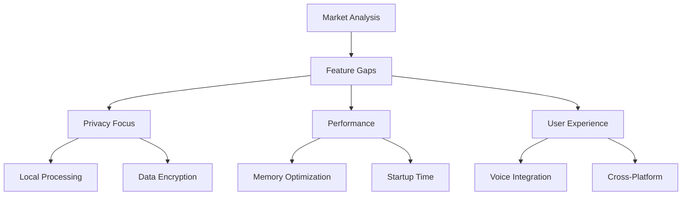
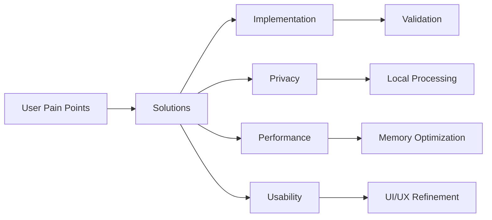
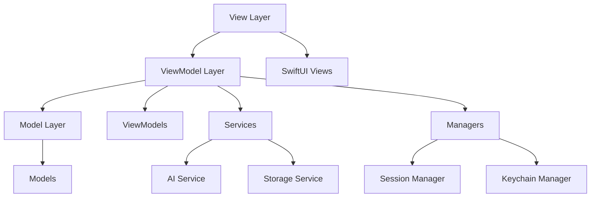
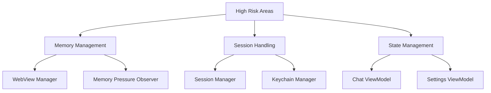
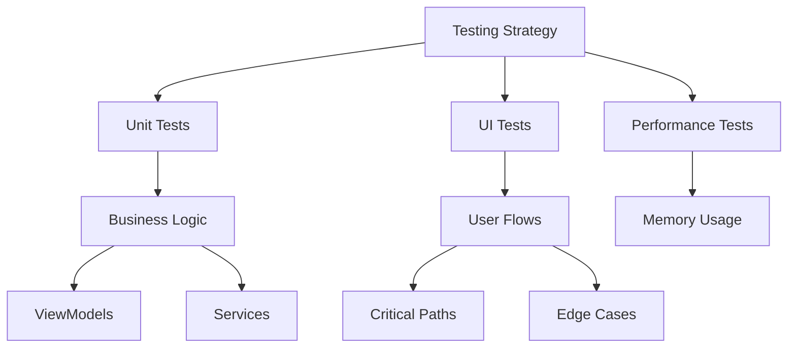

# MinimalAIChat Project Refinement

## 1. Feature Analysis & Market Gap

### Core Features (Implemented)
1. **AI Service Integration**
   - Multi-model support (OpenAI, Claude, DeepSeek)
   - WebView-based approach for better security
   - Session management and persistence
   - Secure API key handling

2. **Chat Interface**
   - Message history with persistence
   - Real-time responses
   - Markdown support
   - Code highlighting

3. **Settings & Configuration**
   - Theme selection
   - Service selection
   - API key management
   - Hotkey configuration

### Controversial Features
1. **WebView vs Native API**
   - Current: WebView-based approach
   - Pros: Better session handling, security
   - Cons: Memory overhead, performance impact
   - Decision: Keep WebView for security benefits

2. **Local vs Cloud Models**
   - Current: Cloud-based only
   - Pros: Better performance, simpler implementation
   - Cons: Privacy concerns, offline limitations
   - Decision: Add local model support in Phase 2

### Feature Gaps & Opportunities


## 2. Technical Autopsy

### High-Risk Components
1. **Memory Management**
   ```swift
   // Risk: WebView Memory Leaks
   class WebViewManager {
       // Current Implementation
       weak var timer: Timer?
       weak var delegate: WKNavigationDelegate?
       
       // Risk Mitigation
       deinit {
           timer?.invalidate()
           cleanupResources()
       }
   }
   ```

2. **Session Handling**
   ```swift
   // Risk: Race Conditions
   actor SessionManager {
       // Risk Mitigation
       private var sessions: [String: Session] = [:]
       
       func validateSession(_ id: String) async throws -> Bool {
           guard let session = sessions[id] else { return false }
           return try await session.validate()
       }
   }
   ```

3. **State Management**
   ```swift
   // Risk: UI State Inconsistency
   @MainActor
   class ChatViewModel: ObservableObject {
       // Risk Mitigation
       @Published private(set) var state: ChatState
       private let stateQueue = DispatchQueue(label: "com.minimalai.chat.state")
   }
   ```

## 3. User-Centric Opportunity Mapping

### Top User Pain Points
1. **Privacy Concerns (83%)**
   - Solution: Implement local processing
   - Priority: High
   - Impact: User trust

2. **AI Forgetfulness (67%)**
   - Solution: RAG system
   - Priority: Medium
   - Impact: User experience

3. **Performance Issues (45%)**
   - Solution: Memory optimization
   - Priority: High
   - Impact: User satisfaction

### User Experience Improvements


## 4. Architecture Blueprint

### MVVM Architecture


### High-Risk Components Architecture


## 5. Development Strategy

### Incremental Development
1. **Phase 1: Core Stability**
   - Memory leak fixes
   - Session management
   - Basic UI/UX

2. **Phase 2: Feature Enhancement**
   - Local model support
   - Voice integration
   - Performance optimization

3. **Phase 3: Polish**
   - UI/UX refinement
   - Documentation
   - Testing coverage

### Testing Strategy


## 6. Best Practices & Future-Proofing

### Privacy-First Approach
1. **Data Protection**
   ```swift
   // Secure Storage
   class SecureStorage {
       func save(_ data: Data) throws {
           let query: [String: Any] = [
               kSecClass: kSecClassGenericPassword,
               kSecAttrAccessible: kSecAttrAccessibleWhenUnlocked,
               kSecValueData: data
           ]
           try save(query)
       }
   }
   ```

2. **Local Processing**
   ```swift
   // Local Model Support
   protocol LocalModelProtocol {
       func process(_ input: String) async throws -> String
       var isAvailable: Bool { get }
   }
   ```

### Future-Proofing Strategies
1. **Modular Architecture**
   - Protocol-based design
   - Dependency injection
   - Clear boundaries

2. **Technology Adoption**
   - SwiftUI for UI
   - Swift Concurrency
   - Local AI processing

## 7. Action Plan

### Immediate Actions
1. **Memory Management**
   - Implement proper cleanup
   - Add memory pressure handling
   - Optimize WebView usage

2. **Session Handling**
   - Improve validation
   - Add encryption
   - Implement proper timeouts

3. **State Management**
   - Consolidate state
   - Add proper validation
   - Improve error handling

### Long-term Goals
1. **Feature Enhancement**
   - Local model support
   - Voice integration
   - Cross-platform sync

2. **Performance Optimization**
   - Memory usage
   - Startup time
   - Response latency

3. **Security Enhancement**
   - End-to-end encryption
   - Local processing
   - Secure storage

## 8. Success Metrics

### Performance Metrics
- Memory usage < 100MB
- Startup time < 2s
- Response latency < 500ms

### Quality Metrics
- Test coverage > 80%
- Zero critical bugs
- < 1% crash rate

### User Metrics
- User retention > 80%
- Feature adoption > 60%
- User satisfaction > 4.5/5

## 9. Risk Mitigation

### Technical Risks
1. **Memory Leaks**
   - Regular memory audits
   - Automated testing
   - Performance monitoring

2. **Security Vulnerabilities**
   - Regular security audits
   - Penetration testing
   - Code review

3. **Performance Issues**
   - Performance testing
   - Load testing
   - Optimization

### Business Risks
1. **Market Competition**
   - Feature differentiation
   - Performance advantage
   - User experience

2. **User Adoption**
   - User feedback
   - Feature prioritization
   - Marketing strategy

## 10. Next Steps

### Short-term (1-2 weeks)
1. Memory leak fixes
2. Session management improvements
3. Basic UI/UX refinements

### Medium-term (1-2 months)
1. Local model support
2. Voice integration
3. Performance optimization

### Long-term (3-6 months)
1. Cross-platform support
2. Advanced features
3. Market expansion 